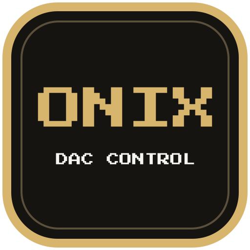

<p align="center">
  
</p>

<h1 align="center">ONIX DAC Control</h1>

<p align="center">
  Control the ONIX Alpha XI1 with global shortcuts or a desktop panel.
</p>

<p align="center">
  <a href="https://github.com/romanio427/ONIX-XI1-Control/releases/latest"></a>
  <a href="LICENSE"></a>
</p>

<p align="center">
  <a href="https://github.com/romanio427/ONIX-XI1-Control/releases/latest"><strong>Download the latest release</strong></a>
</p>

ONIX DAC Control lets you change the XI1's hardware volume and settings without reaching for the device. It runs in the background, with a compact panel for when you want to see all the controls.

## See it in action

### Hardware control without leaving your work

Adjust hardware volume and cycle DAC settings with global shortcuts. Every change appears in the compact flyout without interrupting your work.

<p align="center">
  
</p>

### Control your DAC from the desktop panel

Open the compact panel to adjust gain, display behavior, and other hardware settings with the mouse.

<p align="center">
  
</p>

### Global shortcuts for every setting

Assign one key or a modifier combination to either direction. A single direction is enough because every list continues from the opposite end.

<p align="center">
  
</p>

## Supported controls

- **Sound:** hardware volume, gain mode, digital filter, and balance.
- **Device and display:** button mode, brightness, screensaver delay, rotation, timeout, and font.

The app detects when the XI1 connects or disconnects and runs in the system tray. You can change its start-at-sign-in setting and choose an English or Russian interface.

## Installation

Download the package for your system from the [latest release](https://github.com/romanio427/ONIX-XI1-Control/releases/latest).

### Windows

**Recommended:** run `ONIX-DAC-Control-windows-x64-setup.exe`. The installer offers Start menu and desktop shortcuts. If the XI1 is connected during installation, it attempts to configure device access; otherwise, the app offers to configure access when you connect the device.

**Portable:** run `ONIX-DAC-Control-windows-x64-portable.exe` without installing the app. It is a single file and does not create files beside the executable. If control access is not configured, the app offers to set it up when the XI1 is connected, either at first launch or after you connect it later. Accepting the offer prompts for administrator permission. If you skip it, use **Settings → Device access → Configure** later.

Both Windows editions start at sign-in by default. Change this in **Settings → Open automatically**.

Device access uses the standard Windows WinUSB driver for the XI1's separate control interface. This setup step does not replace the DAC's audio driver.

### macOS

Open `ONIX-DAC-Control-macos-universal.dmg`, then drag **ONIX DAC Control** into **Applications**. The universal application supports both Intel and Apple Silicon Macs.

Global shortcuts require permission in **System Settings → Privacy & Security → Accessibility**. Enable access for **ONIX DAC Control**, then restart the app.

The macOS build is not notarized by Apple. If macOS blocks the first launch, follow [Apple's instructions for opening an app from an unidentified developer](https://support.apple.com/en-gb/102445).

### Linux

Debian, Ubuntu and Linux Mint:

```bash
sudo apt install ./ONIX-DAC-Control-linux-x64.deb
```

Fedora and other RPM-based distributions:

```bash
sudo dnf install ./ONIX-DAC-Control-linux-x64.rpm
```

The packages install the required device-access rule automatically. If your desktop asks you to approve global shortcuts, confirm them in the system dialog.

## Compatibility

| Platform | Requirements |
| --- | --- |
| Windows | Windows 10 and 11, x64 |
| macOS | macOS 13 or later, Intel and Apple Silicon |
| Linux | x64, glibc 2.35 or later, X11 or XWayland |
| DAC | ONIX Alpha XI1 |

On Wayland desktops, the app requires XWayland to display its windows. On both X11 and Wayland, global shortcuts require a desktop portal backend that supports [GlobalShortcuts](https://flatpak.github.io/xdg-desktop-portal/docs/doc-org.freedesktop.portal.GlobalShortcuts.html). If your desktop does not provide it, use the panel to control the DAC.

## Keyboard shortcuts

By default, hold **Ctrl** (**Control** on macOS) and press your keyboard's **Volume Up** or **Volume Down** key to adjust the XI1's hardware volume.

To change these shortcuts or add shortcuts for other settings:

1. Open **Settings → Keyboard shortcuts**.
2. Select a field and press a key or combination, such as `F8` or `Ctrl + Shift + F`.
3. Click **Save**.

For device settings, assign **Forward**, **Back**, or both. Options wrap around from the last to the first, so a single direction is enough to reach every value.

## Troubleshooting

- **Windows: XI1 detected, but controls do not respond.** Open **Settings → Device access → Configure** to set up the XI1's control interface again.
- **Linux: shortcuts do not work.** Check that your desktop supports GlobalShortcuts (see [Compatibility](#compatibility)). If it does, restart shortcuts from the tray menu and approve the system dialog.
- Only one copy of ONIX DAC Control should control the DAC at a time.

Report problems through [GitHub Issues](https://github.com/romanio427/ONIX-XI1-Control/issues). Include your operating system, app version, and the steps that trigger the problem.

## Support

If you would like to support development, the same options are available in the app's About window:

<p align="center">
  <a href="https://ko-fi.com/romanio427"></a>&nbsp;&nbsp;&nbsp;
  <a href="https://liberapay.com/romanio427"></a>&nbsp;&nbsp;&nbsp;
  <a href="https://romanio427.github.io/"></a>
</p>

## License

ONIX DAC Control is released under the [MIT License](LICENSE). Third-party components retain their respective licenses; notices are included with every packaged release.
